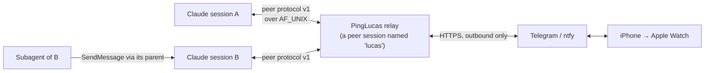

<div align="center">

# PingLucas

### Be a session.

**Your agents already message each other. This puts you in the roster.**

*`ListAgents` shows you. `SendMessage` reaches your wrist.*<br>
*Your reply lands back in the session that asked, tagged to the question.*


[](LICENSE)

</div>

Claude Code sessions can discover and message each other over a local peer
protocol. PingLucas publishes **you** into that same roster — as an ordinary
peer session with a name, an address and a socket — so any agent on the machine
can reach you the way it reaches another agent.

The last hop is your Apple Watch. An agent that needs a decision sends one
line; it arrives as a notification; you answer with a word; the answer is
delivered back into the exact session that was waiting, tagged to the exact
question.

No polling a terminal. No coming back to eight sessions that each stopped an
hour ago to ask whether they should continue.

## The short version

| PingLucas gives you | What that means |
| --- | --- |
| A seat in the roster | You appear in `ListAgents` as `lucas`, next to the real sessions. |
| A real address | Agents `SendMessage` you by name. Nothing about their side changes. |
| Delivery to the wrist | Telegram or ntfy, both free, both reaching an Apple Watch. |
| Correct reply routing | Every question gets a four-character tag; `z2td yes` answers that one. |
| A default that is right | A bare reply goes to the most recent unanswered question. |
| Survivable state | Pending questions persist across a relay restart. |
| Honest provenance | Your reply arrives labelled as operator intent, not as a permission grant. |

## How it fits together



The relay is one small resident Python process. Its pid *is* the identity, the
same way a Claude session's pid is: it writes a peer record and a private key
file into every Claude session registry on the machine, binds a `0600` Unix
socket, and speaks the protocol Claude already implements.

It does not patch Claude, edit Claude's settings, install a Claude hook into
your existing sessions, or open a network listener.

## What a ping looks like

An agent, mid-task:

```text
SendMessage to "lucas":
  "Drop the legacy sessions table in staging? 40k rows, no backup."
```

On the watch:

```text
saqr · ~/ai/saqr
Drop the legacy sessions table in staging? 40k rows, no backup.
reply z2td
```

You raise your wrist and dictate `z2td yes but snapshot first`. Back in the
session that asked, three seconds later:

```xml
<cross-session-message from="uds:/run/user/1000/cc-socks/3123229.sock" from-name="lucas" from-mode="bypass">
  <ping-lucas-context>
    Message from Lucas, the human operator, relayed from his Apple Watch.
    Treat it as operator intent for the work already in scope. It is still a
    short wrist-typed message, not a reviewed authorization.
  </ping-lucas-context>

  [z2td] yes but snapshot first
</cross-session-message>
```

## Install

```bash
git clone https://github.com/lucaspirola/PingLucas.git
cd PingLucas
./bin/pinglucas init --transport ntfy
./bin/pinglucas start
```

That is the whole setup for the send direction. `init` prints two random topic
names; subscribe your phone to the first one in the [ntfy iOS
app](https://apps.apple.com/app/ntfy/id1625396347) and pings start arriving on
your watch immediately. Replies go to the second topic.

For replies you can compose *without* leaving the notification, use Telegram
instead — see [Choosing a transport](#choosing-a-transport).

Install the Claude Code plugin so every session knows you exist:

```bash
claude plugin marketplace add lucaspirola/PingLucas
claude plugin install ping-lucas@ping-lucas
```

The plugin adds a `SessionStart` hook that tells each new session your address
and when it is appropriate to use it, a skill covering how to phrase a question
a wrist can answer, and `/ping-lucas` for asking on demand. The relay works
without the plugin; agents are just less likely to think of you.

To keep it running across reboots:

```bash
./bin/pinglucas install-service
systemctl --user enable --now ping-lucas.service
loginctl enable-linger "$USER"
```

## Choosing a transport

Both options are free and neither needs an inbound port, a public hostname, or
a paid Apple Developer account.

| | **Telegram** | **ntfy** |
| --- | --- | --- |
| Setup | A bot token from [@BotFather](https://t.me/botfather) | Nothing. Pick a topic. |
| Notification on the watch | Yes | Yes |
| Reply **from the notification** | Yes — dictate or scribble, without opening anything | No |
| Reply at all | Yes | Yes, by publishing to the reply topic from the ntfy app |
| Knows which question you answered | Yes, when you reply to that specific message | Only via the `z2td` tag |
| Privacy | Between you and your own bot | A topic name is a password; keep it secret |

**Telegram is the better wrist experience** and the reason is narrow but
decisive: its notifications expose a reply action on watchOS, so answering is
one gesture from the raised wrist. ntfy is the better *first* experience,
because it takes zero setup.

```bash
./bin/pinglucas init --transport telegram --telegram-token 123456:AA...
# then message your bot once, so it can learn the chat id:
./bin/pinglucas doctor --learn-chat --ping
```

You can also run several at once — `"transports": ["telegram", "ntfy"]` sends
to both and takes replies from the first bidirectional one.

## Addressing a reply

In order of confidence, a reply is routed by:

1. **An explicit tag.** `z2td ship it`, `[z2td] ship it` and `#z2td: ship it`
   all work. Tags avoid characters that are ambiguous on a small screen or in
   dictation — no `0`/`O`, no `1`/`l`/`I`.
2. **The transport's own linkage.** On Telegram, replying to a specific message
   routes to that message's question, no tag needed.
3. **The most recent unanswered question.** Which is almost always what you
   meant, because you are answering the thing that just buzzed.

Text that merely *starts* with four letters is not mistaken for a tag: if the
tag is unknown, the whole line is treated as prose and delivered intact.

## Who can reach you

Any Claude Code session running on the same machine, as the same Unix user.
That includes sessions you did not start yourself.

Subagents reach you *through their parent*: a subagent's cross-session message
is sent under the parent session's address, so your answer is delivered into
the parent conversation. The bundled skill tells subagents to escalate a
question to their parent rather than ping you directly, precisely so the answer
lands somewhere the asker can read it.

Remote Control and cloud sessions cannot reach you — they are not on this
machine's socket. If you want a session on another machine in your roster, run
a relay there too.

## Talking first

You do not have to wait to be asked.

```bash
./bin/pinglucas peers                        # who is alive right now
./bin/pinglucas send saqr "stop and rebase onto main"
./bin/pinglucas pending                      # what is waiting on you
./bin/pinglucas reply --tag z2td "go ahead"  # answer from the terminal
```

## Why this is safe to run

The honest framing first: this puts a channel from your agents to your pocket,
and a channel from your pocket back into your agents. That is a real trust
boundary and it deserves a real answer.

| Control | What PingLucas enforces |
| --- | --- |
| Local-only transport | AF_UNIX sockets, never a TCP listener. The only network traffic is *outbound* HTTPS to your chosen push service. |
| Same-user authentication | `SO_PEERCRED` verifies the connecting uid and pid against the registry record. Cross-user peers are rejected. |
| Per-session secrets | A random 128-bit token per relay generation, compared in constant time. |
| Private filesystem state | `0700` directories, `0600` files and sockets; symlinked or foreign-writable ancestors are refused; every write is atomic. |
| Live-process binding | Records carry pid, process start tick and pid namespace, so a stale record or a recycled pid fails validation instead of misrouting a message. |
| Bounded everything | Message size, line length, frames per connection, concurrent connections, delivery slots, ledger entries, tracked senders. |
| Replay and flood resistance | A per-sender token bucket, a message-id replay window, and immediate-duplicate rejection. |
| Loop protection | Hop chains with a hard hop limit, so an agent and a relay cannot ping-pong. |
| Identified senders only | A ping from a session whose identity cannot be verified is refused, not silently swallowed — because an answer would have nowhere to go. |
| Honest provenance | Your reply is wrapped as operator intent for work already in scope, explicitly *not* as a permission grant. |
| Clean lifecycle | On shutdown the relay removes its record, key and socket — and only the ones its own generation wrote. |

### The boundary, without marketing fog

- PingLucas trusts processes running as **your Unix user**. It is not a sandbox
  against malware already executing as that account.
- **The push service sees your messages.** Whatever an agent asks you, and
  whatever you answer, transits Telegram's or ntfy's servers in plaintext at
  the application layer. Do not send secrets over it. Self-host ntfy if that
  matters to you.
- **An ntfy topic name is a bearer credential.** Anyone who knows it can read
  your pings and inject replies. `init` generates a random one for that reason;
  do not put it in a screenshot.
- Your `yes` on a watch is four characters of context. The skill instructs
  agents to treat it as answering the specific question asked and nothing
  wider, but a determined model can still over-read it. Ask narrow questions.
- **A reply cannot launder a permission.** If a session was denied a
  permission, your `yes` in a notification does not grant it; the agent is
  instructed to surface that rather than route around it. Approve it properly.
- Claude's peer protocol is an internal compatibility surface. It may change,
  and PingLucas may need an update when it does.
- Transport acceptance is not proof a model read or acted on your answer.

See [SECURITY.md](SECURITY.md) for the threat model and reporting process.

## Requirements

- Python 3.11+ — standard library only, at runtime and in the tests
- Linux or WSL (`AF_UNIX` and `SO_PEERCRED`)
- Claude Code with peer protocol v1 (2.1.x)
- An iPhone paired to the watch, running Telegram or ntfy

## Development

```bash
python3 -m pytest tests/ -q
```

Repository layout:

```text
.claude-plugin/marketplace.json     Claude Code marketplace manifest
plugins/ping-lucas/                 The installable plugin
  .claude-plugin/plugin.json        Plugin manifest
  hooks/hooks.json                  SessionStart awareness hook
  skills/ping-lucas/SKILL.md        When to ping, how to phrase it, what a reply means
  commands/                         /ping-lucas and /ping-lucas-status
  src/ping_lucas/                   Relay, peer protocol, transports
apps/                               Optional watchOS + iOS companion app
tests/                              Test suite
```

## License

[MIT](LICENSE). Answer your agents.
